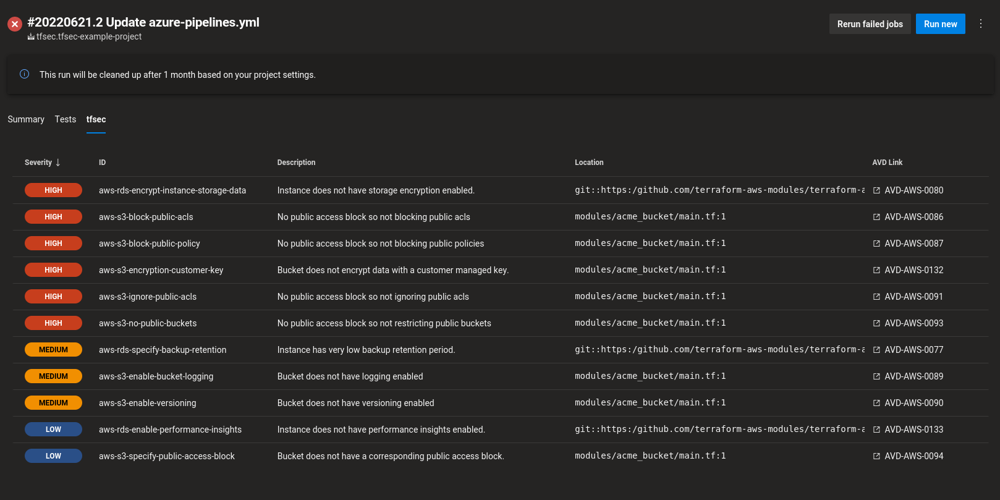

# tfsec



## Installation

1. Install the tfsec task in your Azure DevOps organization (hit the `Get it free` button above).

2. Add the task to your `azure-pipelines.yml` in a project where you'd like to run tfsec:

```yaml
- task: tfsec@1
```

## Configuration

You can supply several inputs to customise the task.

### Enable debug mode

Add debug logs to the task output.

```yaml
- task: tfsec@1
  inputs:
    debug: true
```

### Specify tfsec version

Run a specific version of tfsec.

```yaml
- task: tfsec@1
  inputs:
    version: v1.26.0
```

### Specify custom command line options

```yaml
- task: tfsec@1
  inputs:
    args: --workspace my-workspace --config-file ./tfsec.yml
```

### Informational only

If you'd like to see the tfsec results in your build, but avoid causing it to fail when issues are discovered, you can add the `--soft-fail` flag to your command line arguments using:

```yaml
- task: tfsec@1
  inputs:
    args: --soft-fail
```
